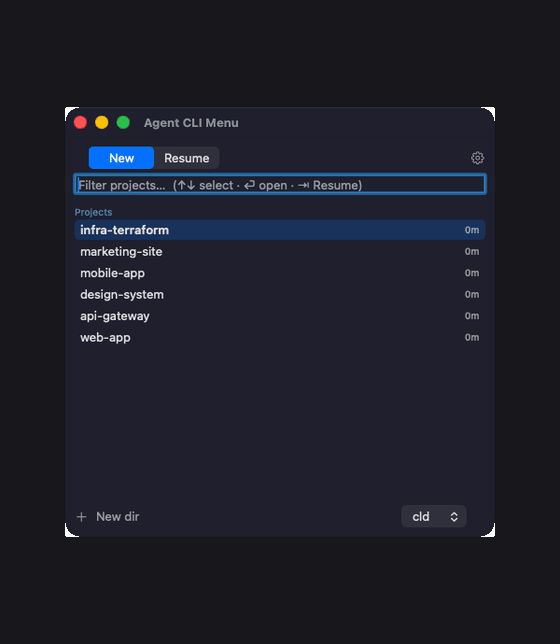
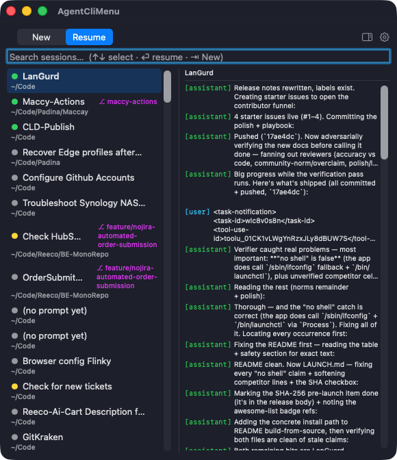
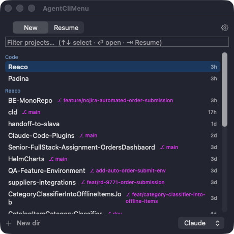
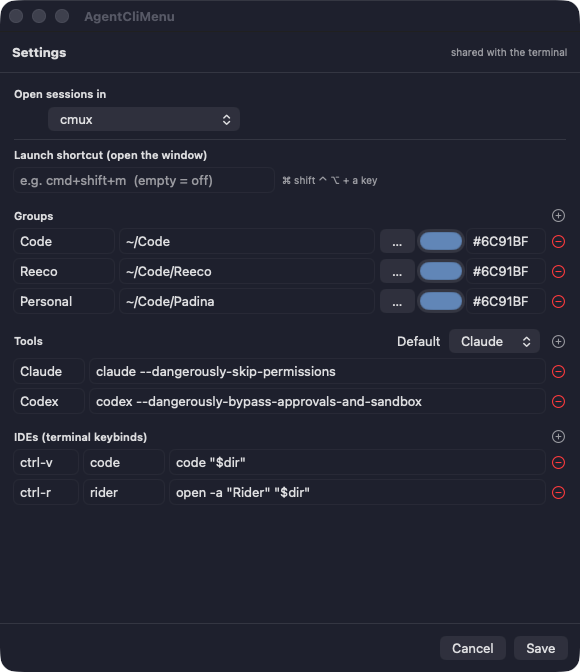

<div align="center">


# Agentctl

### One menu for every Claude & Codex session — start a new one in any project, or search and resume an old one.

A fast launcher for coding-agent sessions: pick a project and start **`claude`** / **`codex`**, or
fuzzy-search and **resume** any past Claude Code session — with a live transcript preview. Ships as a
terminal menu (**`agentctl`**) **and** a native macOS menu-bar app that share one config.

[](https://www.apple.com/macos/)
[](https://nodejs.org)
[](https://swift.org)
[](https://github.com/roypadina/homebrew-tap)
[](https://github.com/roypadina/Agentctl/releases/latest)
[](https://github.com/roypadina/Agentctl/actions/workflows/ci.yml)
[](LICENSE)
[](CONTRIBUTING.md)
[](https://github.com/roypadina/Agentctl/stargazers)

</div>

---

## Table of Contents

- [Why](#why)
- [Features](#features)
- [Screenshots](#screenshots)
- [Install](#install)
- [The terminal menu](#the-terminal-menu)
- [Names, notes, flags and reminders](#names-notes-flags-and-reminders)
- [Several Claude accounts](#several-claude-accounts)
- [The Mac GUI](#the-mac-gui)
- [Configuration](#configuration)
- [How it works](#how-it-works)
- [Is it safe?](#is-it-safe)
- [Uninstall](#uninstall)
- [Contributing](#contributing)
- [Support](#support)
- [License](#license)

## Why

You start coding-agent sessions all day — `claude` here, `codex` there — and then you want to jump
back into one from yesterday but can't remember which folder it was in. Claude Code stores every
session under `~/.claude/`, but there's no good way to *find* one.

Agentctl is two halves of that workflow in one tool:

- **New** — pick a project directory (grouped, frecency-sorted, fuzzy-filtered) and launch your agent
  there. Open it in your IDE first, in tmux, after a `git pull`, or create a brand-new directory on the fly.
- **Resume** — fuzzy-search every Claude Code session by name, path, or **full transcript text**, preview
  the conversation, and resume it in its original working directory.

It's **local-only** — it reads `~/.claude/` and your project folders, and runs no network calls of its own.

## Features

| | |
|---|---|
| 🆕 **New-session launcher** | Grouped project dirs, frecency-sorted (`z`, falls back to mtime), fuzzy filter, git branch per row. |
| 🔁 **Resume anything** | Every Claude Code session, fuzzy-matched on name / path / id — or full-text searched across transcripts. |
| 👀 **Transcript peek** | Preview a session's conversation before resuming — inline in the terminal, side-pane in the GUI. |
| 🧠 **AI recap** | `r` summarizes a session (what it was doing, decisions, state, follow-ups) via `claude -p` on haiku, cached. Decide whether to resume without reading the whole transcript. |
| ⌨️ **Two tabs, one keystroke** | Start in **New**; `⇥` flips to **Resume**; `⇧⇥` cycles the tool. Same model in TUI and GUI. |
| 🧰 **Your tools & IDEs** | Configure any agent command (`claude`, `codex`, …) and `^`-key IDE binds (VS Code, Rider, …). |
| 🪄 **tmux / pull / Finder / new-dir** | One-key open-in-tmux, `git pull` first, reveal in Finder, or make a new directory anywhere. |
| 🖥️ **Native Mac GUI** | A SwiftUI menu-bar app — keyboard-driven picker, transcript preview, in-app config editor, global hotkey. |
| 🏷️ **Names, notes, flags, reminders** | Rename any session (as often as you like), pin a note to it, tag it `todo`, mark it done, or set a reminder — from the picker, the CLI, or from inside the session itself. |
| 👥 **Every Claude profile** | Run several accounts via `CLAUDE_CONFIG_DIR`? All of their sessions show up, live status included — and resume runs under the right profile instead of silently using the wrong account. |
| 🤝 **Shared config** | One TOML file drives both the terminal and the GUI. Edit it by hand or in the GUI's Settings. |
| 🔐 **No cloud, no telemetry** | Reads local files only. No accounts, no analytics, no network calls of its own. |

## Screenshots

> **The Mac menu-bar app** — start a new session, fuzzy-resume a past one with a transcript peek, then edit the shared config, all from the menu bar:
>
> 

> **The Mac GUI — Resume**, with the transcript preview pane open:
>
> 

<table>
<tr>
<td width="50%" valign="top">

**New** — grouped, frecency-sorted projects.



</td>
<td width="50%" valign="top">

**Settings** — shared with the terminal.



</td>
</tr>
</table>

The terminal menu mirrors the same model — start in **New**, `⇥` to **Resume**:

```
 resume   24 sessions  ·  3 active  ·  2/24      ● busy  ● idle  ○ inactive
 ╭──────────────────────────────────────────────┬────────────┬──────────────╮
 │   SESSION                                      │ BRANCH     │ LAST USED    │
 ├──────────────────────────────────────────────┼────────────┼──────────────┤
 │ ▶ ● Agentctl — GUI keyboard nav            │ main       │ 2m ago       │
 │   ○ Recover Edge profiles after crash          │ main       │ 19h ago      │
 │   ○ reeco-item-classifier POC                  │ poc/bert   │ 2d ago       │
 ╰──────────────────────────────────────────────┴────────────┴──────────────╯
 ╭ Agentctl — GUI keyboard nav ─────────────────────────────────────────╮
 │ a1b2c3d4 · ● busy · ⎇ main                                                │
 │ started Jun 5 13:06 · last used Jun 9 17:30 (2m ago)                      │
 │ ~/Code/Padina/Agentctl                                                │
 │ recap  • Redesigned Resume as a bordered table with a details pane.       │
 │        • Added an AI recap (claude -p · haiku, cached).                   │
 ╰───────────────────────────────────────────────────────────────────────────╯

 ↑/↓ move  ·  ⏎ resume  ·  r recap  ·  p peek  ·  / filter  ·  s search  ·  ? help  ·  q quit
```

## Install

> **Requires macOS 12+** and **Node 18+** (the terminal menu runs on Node; the GUI bundles its CLI and depends on Node via Homebrew).

### Homebrew (GUI app + `agentctl` CLI, one install)

```bash
brew install --cask roypadina/tap/agentctl
```

This installs **Agentctl.app** (the menu-bar GUI) and puts **`agentctl`** on your `PATH`.

> Agentctl is ad-hoc signed (not notarized). On first launch, **right-click Agentctl in
> `/Applications` → Open** (then Open again), or run once:
> ```bash
> xattr -dr com.apple.quarantine "/Applications/Agentctl.app"
> ```
> See [Is it safe?](#is-it-safe).

### From source

```bash
git clone https://github.com/roypadina/Agentctl.git
cd Agentctl
npm install
npm run build
npm link            # puts agentctl + agentctl on your PATH

# optional: build the Mac GUI
bash gui/build-app.sh
open "gui/Agentctl.app"
```

First run sets up a starter config: `agentctl config --setup`.

## The terminal menu

`agentctl` opens the menu — **New** by default, `⇥` to **Resume** (or jump straight there with `-r`).
Want `cld`/`cdx`-style per-tool shortcuts? Add your own shell aliases.

| Command | Opens |
|---|---|
| `agentctl` &nbsp;·&nbsp; `agentctl` | New-session menu (`⇥` to Resume) |
| `agentctl -r` &nbsp;·&nbsp; `agentctl -r` | Resume menu |

Plus non-interactive subcommands:

```bash
agentctl ls [--cwd <path>] [--active] [--json] [--sort updated|started|name] [--limit N]
agentctl peek <id> [--full] [--head N --tail N]   # print a transcript
agentctl recap <id> [--refresh]                   # AI summary of a session (cached)
agentctl resume <id> [--yes] [--cwd <override>]   # resume by id (prefix ≥ 4 chars)
agentctl ls --tool | --interactive                # only tool runs / only real sessions
agentctl path <id>                                # print the .jsonl path
agentctl config --setup | --edit | --path         # manage the shared config
```

### Keys

**New** — `↑/↓` move · type to fuzzy-filter · `↵` launch · `⇥` Resume · `⇧⇥` cycle tool · `^n` new dir ·
`^t` tmux · `^p` pull · `^f` Finder · `^`-key IDEs · `?` full keymap · `esc` back.

**Resume** — `↑/↓` (or `j/k`) move · `pgup/pgdn` page · `g/G` first/last · `↵` resume · `p` peek · `r` recap ·
`/` fuzzy-filter · `s` full-text search · `^r` refresh · `⇥` New · `?` help · `q` quit.
Annotate the highlighted session in place: `e` name · `n` note · `l` labels · `f` flags · `t` reminder ·
`u` due date · `d` done. `c` copies a resume command, `h` hides a session, `x` deletes it (twice),
`v` shows the hidden ones, `H` shows/hides done ones, `T` filters tool runs. (`l` pre-fills the issue
key from the branch.)

**Menu-bar app** — the same letters, with ⌘. Type to filter, `↑/↓` to move, `⏎` to resume, and
`⌘/` for the whole list in the app (there is no menu bar to find them in):

| | | | |
|---|---|---|---|
| `⌘E` name | `⇧⌘N` note | `⌘L` labels | `⇧⌘F` flags |
| `⌘T` remind | `⌘U` due | `⌘D` done | `⇧⌘H` hide |
| `⌘X` / `⌘⌫` delete | `⌘P` details pane | `⌘R` recap | `⇧⌘C` copy resume command |
| `⇧⌘D` hide done | `⇧⌘T` tool runs | `⇧⌘V` hidden | `⇧⌘R` reload |
| `⇧⌘A` account | `⌘F` clear search | `⌘,` settings | `⇥` New ⇄ Resume |
| `⌘M` mark | `⇧⌘M` clear marks | | |

`⌘M` marks a session; `⌘D`, `⇧⌘H` and `⌘⌫` then act on every marked one at once, the same rule
`space` follows in the terminal menu.

⌘ is what separates a command from typing — the search field holds focus permanently. Where macOS
already owns a combination (`⌘H` hides the app, `⌘X`/`⌘C`/`⌘V` edit text) the shift variant is used,
and delete answers to both `⌘X` (the terminal menu's key) and Finder's `⌘⌫`. The annotation shortcuts open the details pane and drop the caret
straight into the right field; `esc` puts it back in the search box.

`space` marks sessions — `h`, `x` and `d` then act on every marked one at once, and the cursor stays
where it was instead of jumping back to the top.

`c` puts `agentctl resume <id>` on your clipboard — paste it in any other terminal to pick that
session back up, working directory and Claude profile included. The menu-bar app has the same as a
copy button next to the session id. Wide terminals also show a short id column in the list.

Deleted sessions are deliberately **not reachable from the menu** — that is what makes deleting feel
safe to do. Recover them with `agentctl delete --undo`, or from the menu-bar app's Deleted view.
Highlighting a row shows its full details + recap inline. A `!` marks a session whose working directory
couldn't be decoded with confidence — `↵` twice to resume anyway.

### Tool runs vs. sessions you actually sat in

A `▸` marks a session something else started — `claude -p`, the SDK, an MCP client — rather than one you
typed into. It comes straight off the transcript's entrypoint, so it is known for dead sessions too.
`T` in the menu cycles **everything → interactive only → tool runs only**; the CLI has `agentctl ls --tool`
and `--interactive`, and the menu-bar app the same three choices in its list menu.

One honest limit: a *real* interactive session that a script drove (tmux `send-keys` into a live
`claude`, say) is recorded by Claude Code as interactive, because that is exactly what it was. Only
headless and SDK entry points are distinguishable.

## Names, notes, flags and reminders

Sessions arrive named after your first prompt, which ages badly. Give them a real name — and everything
else you'd want to remember about them:

```bash
agentctl name  "billing spike"     # rename it; as many times as you like
agentctl note  "waiting on Dor"    # a note that shows under the row
agentctl flag  todo later          # tags; the picker's filter searches them
agentctl remind 2h                 # or 30m · 3d · tomorrow 9am · 17:00 · an ISO date
agentctl done                      # finished (--undo reopens); h hides done sessions
agentctl annotations               # everything you've annotated  (--due for what's come due)
```

Run inside a Claude session, they target **that** session — no id needed. From anywhere else, add
`-s <id-or-prefix>`. Rows show `✓` done, `⚑` flagged, `✎` noted, `◆` reminder, `✱` due date — red once overdue.
Labels and flags are both matched by the picker's filter, so `RD-12345` finds every session on that ticket.

It's stored in `~/.config/agentctl/annotations/<session-id>.json`, one small file per session,
deliberately outside `~/.claude` — nothing here can corrupt a transcript.

### From inside Claude Code

The [`agentctl-sessions` plugin](https://github.com/roypadina/padina-claude-code-plugins) gives Claude the whole toolset:

- **Slash commands** — `/agentctl-name`, `/agentctl-note`, `/agentctl-label`, `/agentctl-flag`,
  `/agentctl-remind`, `/agentctl-due`, `/agentctl-done`.
- **A `SessionStart` hook** that hands each session its own name, labels, note and due state back, so a
  resumed session knows what it is and what is overdue.
- **A skill** that teaches Claude to do it unprompted — name the session once the task is clear, label it
  with the issue key from your branch — and to drive every command when you just ask in plain words
  ("mark this done", "remind me in 2h", "what do I need to get back to?"). If `agentctl` isn't installed
  it offers to install it rather than failing quietly.

```
/plugin marketplace add roypadina/padina-claude-code-plugins
/plugin install agentctl-sessions@padina
```

## Several Claude accounts

Claude Code keeps each account in its own `CLAUDE_CONFIG_DIR` (`~/.claude`, `~/.claude2`, …). Agent CLI
Menu scans **all** of them, so every session is listed with the correct live status, and resuming pins
`CLAUDE_CONFIG_DIR` to the profile that session belongs to. To *start* new sessions on a given account,
add one tool per profile:

```toml
[[tool]]
name  = "work"
runs  = "CLAUDE_CONFIG_DIR=~/.claude2 claude --dangerously-skip-permissions"
label = " ⚡ Work account "
```

`⇧⇥` cycles between them. The same trick works for any tool and any env var — Codex profiles
included; `runs` is just a shell command.

**Resuming** picks the account automatically: a session running under a side profile is resumed
under it. For a session that has already exited, that information is not recorded anywhere — when
profiles share a `projects/` dir (which the usual setup symlinks), nothing on disk says which
account created it — so it falls back to your default. Override it with `a` in the menu, the account
menu in the app, or `agentctl resume <id> --profile ricky@example.com`.

**If you have one Claude account — the normal case — none of this appears.** No account row, no
picker, no extra keys.

## The Mac GUI

A SwiftUI menu-bar agent (look for **✦** in the menu bar). Click it for the popover, or detach into a
resizable window. It's a thin view over the same `agentctl` back-end — it never parses your config or reads
`~/.claude` itself.

- **Fully keyboard-driven** — type to filter, `↑/↓` to select, `↵` to launch/resume, `⇥` to switch tabs,
  `esc` to clear or close. The search field keeps focus the whole time. Clicking outside the window or
  pressing `esc` dismisses it (menu-bar-panel feel).
- **Details + recap on select** — highlight a session to see its full metadata (id, status, branch,
  started, **last used**, cwd) and a **Generate recap** button — an AI summary so you know what it was
  doing before you resume.
- **Transcript preview** — read a session's recent transcript on the right before resuming. Drag the
  divider to **resize** the list / preview split.
- **In-app Settings** — edit groups (with color pickers), tools, IDE binds, the terminal to open
  sessions in, and a **global hotkey** to summon the window. Saves to the same TOML the terminal reads.
- **Configurable terminal** — open sessions in the system default, or in Terminal / iTerm / Ghostty /
  Warp / kitty / WezTerm / cmux, or a custom command.

## Configuration

One TOML file, shared by the terminal and the GUI:

```
$AGENTCTL_CONFIG  →  $XDG_CONFIG_HOME/agentctl/config.toml  →  ~/.config/agentctl/config.toml
```

`agentctl config --setup` writes a starter; `agentctl config --edit` opens it; the GUI's **Settings** edits the same file.
See [`config.example.toml`](config.example.toml) for every option. The shape:

```toml
default_tool = "cld"

[[group]]                       # a section in the New screen; `path` is scanned one level deep
name  = "Work"
path  = "~/code/work"
color = "#6C91BF"

[[tool]]                        # an agent launcher: `runs` is executed in the chosen dir
name  = "cld"
runs  = "claude --dangerously-skip-permissions"

[[ide]]                         # an fzf-style ^key that opens an editor, then the tool
key   = "ctrl-v"
label = "code"
cmd   = 'code "$dir"'

[gui]
terminal = "default"            # or Terminal | iTerm | Ghostty | Warp | kitty | WezTerm | cmux | custom
# hotkey = "cmd+shift+m"        # global shortcut to open the GUI window
```

## How it works

A clean two-layer split keeps the logic reusable and testable:

| Layer | Role |
|---|---|
| **`src/core/`** | Pure data — zero React/ink. Session scan & cwd-decode, streaming JSONL parse, live-PID status, git branch, fuzzy matcher, TOML config, project scanner, launch planner. Unit-tested. |
| **`src/cli/`** | The ink TUI (New + Resume tabs, peek, search) and the non-interactive subcommands. The only layer that touches presentation. |
| **`gui/`** | A native SwiftUI menu-bar + window app. A thin client over `agentctl gui …` (JSON in, launch out) — it imports none of the Node code and re-reads nothing. |

Session names come from the transcript in priority order: a `/rename` custom title → an auto-generated
title → the first user prompt. Status (`busy`/`idle`/`inactive`) is derived from a live PID file plus a
`kill -0` / `ps` check. Working directories are decoded from Claude Code's ambiguous `-`-encoded folder
names by walking the filesystem — and flagged when the result isn't certain.

📖 Full docs are in the **[Wiki](https://github.com/roypadina/Agentctl/wiki)** (Installation · Commands · Configuration · GUI · Architecture · FAQ). See [`CLAUDE.md`](CLAUDE.md) for the contributor module map.

## Is it safe?

- **Open source (MIT).** Read or build every line yourself.
- **Local-only. No network calls of its own, no analytics, no accounts.** It reads `~/.claude/` and the
  project folders you configure, and launches your terminal. That's it.
- **`--dangerously-skip-permissions`.** The default tool commands include Claude's
  `--dangerously-skip-permissions` (and Codex's sandbox-bypass) flag, because this is a launcher for your
  own machine — it's how `cld` always worked. You can change `runs` in your config to drop it.
- **Ad-hoc signed, _not_ notarized.** macOS can't verify the developer, so the first launch of the GUI is
  blocked until you **right-click → Open** (or clear quarantine — see [Install](#install)). Notarization
  needs a paid Apple Developer ID; it's on the roadmap. Prefer not to trust a prebuilt binary? Build from source.

## Uninstall

```bash
brew uninstall --cask agentctl        # if installed via Homebrew
# or: npm unlink -g agentctl          # if installed from source via npm link

rm -rf ~/.config/agentctl             # forget config (optional)
```

## Contributing

PRs welcome! `main` is protected — fork, branch, add tests, and open a PR. See
[CONTRIBUTING.md](CONTRIBUTING.md) and the [Code of Conduct](CODE_OF_CONDUCT.md).

```bash
npm test && npm run typecheck && npm run build   # the whole check
```

## Support

If Agentctl saves you some clicks and tab-hunting, you can
[**buy me a coffee on Ko-fi ☕**](https://ko-fi.com/roypadina) — totally optional, always appreciated.
A **⭐ star** helps just as much.

## License

[MIT](LICENSE) © Roy Padina
